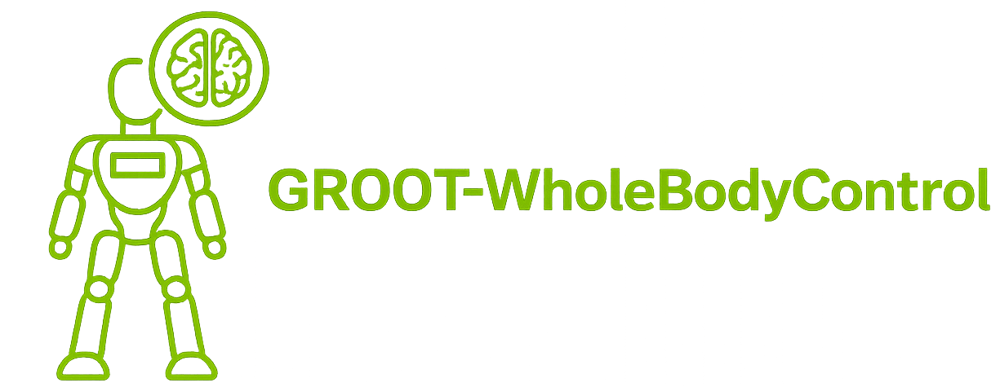
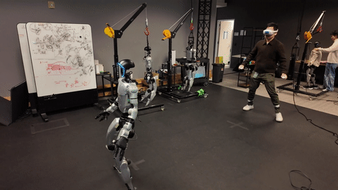

<div align="center">

  

  <!-- --- -->
  
  
</div>

<div align="center">

[](LICENSE)
[](https://github.com/isaac-sim/IsaacLab/releases/tag/v2.3.0)
[](https://nvlabs.github.io/GR00T-WholeBodyControl/)

</div>

---


# GR00T-WholeBodyControl

This is the codebase for the **GR00T Whole-Body Control (WBC)** projects. It hosts model checkpoints and scripts for training, evaluating, and deploying advanced whole-body controllers for humanoid robots. We currently support:

- **Decoupled WBC**: the decoupled controller (RL for lower body, and IK for upper body) used in NVIDIA GR00T [N1.5](https://research.nvidia.com/labs/gear/gr00t-n1_5/) and [N1.6](https://research.nvidia.com/labs/gear/gr00t-n1_6/) models;
- **GEAR-SONIC Series**: our latest iteration of generalist humanoid whole-body controllers (see our [whitepaper](https://nvlabs.github.io/GEAR-SONIC/)).

## Table of Contents

- [GEAR-SONIC](#gear-sonic)
- [VR Whole-Body Teleoperation](#vr-whole-body-teleoperation)
- [Kinematic Planner](#kinematic-planner)
- [TODOs](#todos)
- [What's Included](#whats-included)
  - [Setup](#setup)
- [Documentation](#documentation)
- [Citation](#citation)
- [License](#license)
- [Support](#support)
- [Decoupled WBC](#decoupled-wbc)


## GEAR-SONIC 

<p style="font-size: 1.2em;">
    <a href="https://nvlabs.github.io/GEAR-SONIC/"><strong>Website</strong></a> | 
    <a href="https://huggingface.co/nvidia/GEAR-SONIC"><strong>Model</strong></a> | 
    <a href="https://arxiv.org/abs/2511.07820"><strong>Paper</strong></a> | 
    <a href="https://nvlabs.github.io/GR00T-WholeBodyControl/"><strong>Docs</strong></a>
  </p>

<div align="center">
  
  
</div>

SONIC is a humanoid behavior foundation model that gives robots a core set of motor skills learned from large-scale human motion data. Rather than building separate controllers for predefined motions, SONIC uses motion tracking as a scalable training task, enabling a single unified policy to produce natural, whole-body movement and support a wide range of behaviors — from walking and crawling to teleoperation and multi-modal control. It is designed to generalize beyond the motions it has seen during training and to serve as a foundation for higher-level planning and interaction.

In this repo, we will release SONIC's training code, deployment framework, model checkpoints, and teleoperation stack for data collection.


## VR Whole-Body Teleoperation

SONIC supports real-time whole-body teleoperation via PICO VR headset, enabling natural human-to-robot motion transfer for data collection and interactive control.

<div align="center">
<table>
<tr>
<td align="center"><b>Walking</b></td>
<td align="center"><b>Running</b></td>
</tr>
<tr>
<td align="center"></td>
<td align="center"></td>
</tr>
<tr>
<td align="center"><b>Sideways Movement</b></td>
<td align="center"><b>Kneeling</b></td>
</tr>
<tr>
<td align="center"></td>
<td align="center"></td>
</tr>
<tr>
<td align="center"><b>Getting Up</b></td>
<td align="center"><b>Jumping</b></td>
</tr>
<tr>
<td align="center"></td>
<td align="center"></td>
</tr>
<tr>
<td align="center"><b>Bimanual Manipulation</b></td>
<td align="center"><b>Object Hand-off</b></td>
</tr>
<tr>
<td align="center"></td>
<td align="center"></td>
</tr>
</table>
</div>

## Kinematic Planner

SONIC includes a kinematic planner for real-time locomotion generation — choose a movement style, steer with keyboard/gamepad, and adjust speed and height on the fly.

<div align="center">
<table>
<tr>
<td align="center" colspan="2"><b>In-the-Wild Navigation</b></td>
</tr>
<tr>
<td align="center" colspan="2"></td>
</tr>
<tr>
<td align="center"><b>Run</b></td>
<td align="center"><b>Happy</b></td>
</tr>
<tr>
<td align="center"></td>
<td align="center"></td>
</tr>
<tr>
<td align="center"><b>Stealth</b></td>
<td align="center"><b>Injured</b></td>
</tr>
<tr>
<td align="center"></td>
<td align="center"></td>
</tr>
<tr>
<td align="center"><b>Kneeling</b></td>
<td align="center"><b>Hand Crawling</b></td>
</tr>
<tr>
<td align="center"></td>
<td align="center"></td>
</tr>
<tr>
<td align="center"><b>Elbow Crawling</b></td>
<td align="center"><b>Boxing</b></td>
</tr>
<tr>
<td align="center"></td>
<td align="center"></td>
</tr>
</table>
</div>

## TODOs

- [x] Release pretrained SONIC policy checkpoints
- [x] Open source C++ inference stack
- [x] Setup documentation
- [x] Open source teleoperation stack and demonstration scripts
- [ ] Release training scripts and recipes for motion imitation and fine-tuning
- [ ] Open source large-scale data collection workflows and fine-tuning VLA scripts. 
- [ ] Publish additional preprocessed large-scale human motion datasets


## What's Included

This release includes:

- **`gear_sonic_deploy`**: C++ inference stack for deploying SONIC policies on real hardware
- **`gear_sonic`**: Teleoperation stack for collecting demonstration data (no training code, YET.)

### Setup

Clone the repository with Git LFS:
```bash
git clone https://github.com/NVlabs/GR00T-WholeBodyControl.git
cd GR00T-WholeBodyControl
git lfs pull
```

## Documentation

📚 **[Full Documentation](https://nvlabs.github.io/GR00T-WholeBodyControl/)**

### Getting Started
- [Installation Guide](https://nvlabs.github.io/GR00T-WholeBodyControl/getting_started/installation_deploy.html)
- [Quick Start](https://nvlabs.github.io/GR00T-WholeBodyControl/getting_started/quickstart.html)
- [VR Teleoperation Setup](https://nvlabs.github.io/GR00T-WholeBodyControl/getting_started/vr_teleop_setup.html)

### Tutorials
- [Keyboard Control](https://nvlabs.github.io/GR00T-WholeBodyControl/tutorials/keyboard.html)
- [Gamepad Control](https://nvlabs.github.io/GR00T-WholeBodyControl/tutorials/gamepad.html)
- [ZMQ Communication](https://nvlabs.github.io/GR00T-WholeBodyControl/tutorials/zmq.html)
- [ZMQ Manager / PICO VR](https://nvlabs.github.io/GR00T-WholeBodyControl/tutorials/vr_wholebody_teleop.html)

### Best Practices
- [Teleoperation](https://nvlabs.github.io/GR00T-WholeBodyControl/user_guide/teleoperation.html)


---

## Citation

If you use GEAR-SONIC in your research, please cite:

```bibtex
@article{luo2025sonic,
    title={SONIC: Supersizing Motion Tracking for Natural Humanoid Whole-Body Control},
    author={Luo, Zhengyi and Yuan, Ye and Wang, Tingwu and Li, Chenran and Chen, Sirui and Casta\~neda, Fernando and Cao, Zi-Ang and Li, Jiefeng and Minor, David and Ben, Qingwei and Da, Xingye and Ding, Runyu and Hogg, Cyrus and Song, Lina and Lim, Edy and Jeong, Eugene and He, Tairan and Xue, Haoru and Xiao, Wenli and Wang, Zi and Yuen, Simon and Kautz, Jan and Chang, Yan and Iqbal, Umar and Fan, Linxi and Zhu, Yuke},
    journal={arXiv preprint arXiv:2511.07820},
    year={2025}
}
```

---

## License

This project uses dual licensing:

- **Source Code**: Licensed under Apache License 2.0 - applies to all code, scripts, and software components in this repository
- **Model Weights**: Licensed under NVIDIA Open Model License - applies to all trained model checkpoints and weights

See [LICENSE](LICENSE) for the complete dual-license text.

Please review both licenses before using this project. The NVIDIA Open Model License permits commercial use with attribution and requires compliance with NVIDIA's Trustworthy AI terms.

All required legal documents, including the Apache 2.0 license, 3rd-party attributions, and DCO language, are consolidated in the /legal folder of this repository.

---

## Support

For questions and issues, please contact the GEAR WBC team at [gear-wbc@nvidia.com](gear-wbc@nvidia.com) to provide feedback! 

## Decoupled WBC

For the Decoupled WBC used in GR00T N1.5 and N1.6 models, please refer to the [Decoupled WBC documentation](docs/source/references/decoupled_wbc.md).


## Acknowledgments
We would like to acknowledge the following projects from which parts of the code in this repo are derived from:
- [Beyond Mimic](https://github.com/HybridRobotics/whole_body_tracking)
- [Isaac Lab](https://github.com/isaac-sim/IsaacLab)
