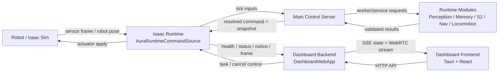
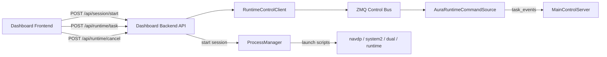
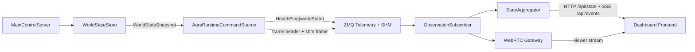
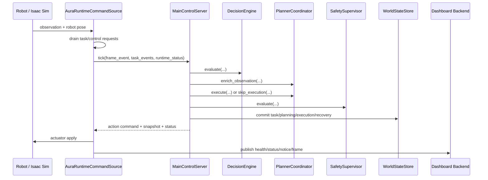

# System Diagram Structure

이 문서는 AURA 전체 시스템을 다이어그램으로 옮기기 쉽게 구조화한 문서다.

초점:

- 메인 서버(`MainControlServer`)
- 런타임(`AuraRuntimeCommandSource` + Isaac Sim 실행 루프)
- 외부 모듈(`Perception`, `Memory`, `S2/Dual`, `Nav`, `Locomotion`)
- 대시보드(Frontend + Backend + WebRTC)
- 제어 채널과 관측 채널의 분리

## 1. 한 줄 요약

현재 canonical 구조는 다음으로 요약된다.

- `AuraRuntimeCommandSource`가 Isaac 쪽 프레임/제어 입력을 수집한다.
- `MainControlServer`가 모든 write-side 판단과 상태 전이를 소유한다.
- `WorldStateSnapshot`이 모든 read-side 관측의 source of truth다.
- Dashboard/WebRTC/legacy mirror는 snapshot을 읽기만 하고, planner truth를 재구성하지 않는다.

## 2. 다이어그램을 그릴 때 권장하는 레벨

### Level 1. 시스템 컨텍스트

가장 바깥 레벨에서는 아래 6개 박스로 충분하다.

1. Dashboard Frontend
2. Dashboard Backend
3. Isaac Runtime
4. Main Control Server
5. Runtime Modules / External Services
6. Robot / Simulator

### Level 2. 컨테이너 분해

Runtime와 Dashboard Backend를 아래처럼 나누면 구조가 명확해진다.

- Dashboard Frontend
  - React/Tauri UI
  - API client
  - SSE listener
  - WebRTC viewer
- Dashboard Backend
  - `DashboardWebApp`
  - `ProcessManager`
  - `RuntimeControlClient`
  - `ObservationSubscriber`
  - `StateAggregator`
  - `WebRTCGateway`
- Isaac Runtime
  - `AuraRuntimeCommandSource`
  - `PlanningSession`
  - `Supervisor`
  - `SubgoalExecutor`
  - runtime bridge(ZMQ + shared memory)
- Main Control Server
  - `TaskManager`
  - `DecisionEngine`
  - `PlannerCoordinator`
  - `SafetySupervisor`
  - `CommandResolver`
  - `WorldStateStore`
- Runtime Modules / External Services
  - Perception worker path
  - Memory worker path
  - Dual planner service(S2)
  - NavDP server(S1)
  - Locomotion worker
- Robot / Simulator
  - Isaac Sim sensor/frame source
  - robot controller / actuator apply

### Level 3. 런타임 시퀀스

별도 시퀀스 다이어그램으로 아래 순서를 그리면 된다.

1. Robot/Simulator가 frame과 robot state를 생성
2. `AuraRuntimeCommandSource.update()`가 frame/task/control을 수집
3. `MainControlServer.tick()`가 task/recovery/planning/safety를 처리
4. 외부 모듈 호출 결과를 `PlannerCoordinator`가 검증
5. `WorldStateStore`가 canonical state를 commit
6. runtime이 actuator command를 적용
7. runtime이 `HealthPing(worldState)`와 frame/status/notice를 publish
8. Dashboard Backend가 snapshot/state/viewer stream을 조립
9. Frontend가 HTTP/SSE/WebRTC로 상태와 영상을 표시

## 3. 시스템 컨텍스트 다이어그램 초안

## 4. 권장 박스 그룹

다이어그램을 그릴 때 아래 4개 경계로 그룹핑하면 읽기 쉽다.

### A. UI / Ops Surface

- Dashboard Frontend
- Dashboard Backend

### B. Runtime Boundary

- `AuraRuntimeCommandSource`
- runtime bridge(ZMQ control, ZMQ telemetry, shared memory frame ring)
- `PlanningSession`
- `Supervisor`
- `SubgoalExecutor`

### C. Control Core Boundary

- `MainControlServer`
- `TaskManager`
- `DecisionEngine`
- `PlannerCoordinator`
- `SafetySupervisor`
- `CommandResolver`
- `WorldStateStore`

### D. Module / Service Boundary

- Perception path
- Memory path
- `DualPlannerService`
- NavDP HTTP server
- locomotion worker

## 5. 노드 정의

| 노드 | 역할 | 주 입력 | 주 출력 |
| --- | --- | --- | --- |
| Dashboard Frontend | 운영 UI, 제어 패널, 상태/영상 표시 | `/api/state`, SSE, WebRTC | 세션 시작/중지, task 요청, cancel |
| Dashboard Backend | 세션 오케스트레이션, 상태 집계, viewer gateway | frontend HTTP 요청, runtime telemetry | aggregated dashboard state, WebRTC session |
| ProcessManager | 런타임 관련 프로세스 기동 | dashboard session request | `navdp`, `system2`, `dual`, `runtime` 프로세스 |
| RuntimeControlClient | dashboard control 메시지 발행 | task/cancel API 요청 | ZMQ control bus 메시지 |
| ObservationSubscriber | runtime telemetry/frame 구독 | ZMQ telemetry, SHM frames | latest `WorldStateSnapshot`, frame cache |
| AuraRuntimeCommandSource | Isaac 루프 진입점, frame/task/control ingress | sensor observation, runtime control | `MainControlServer.tick()` 호출, health/frame/status publish |
| MainControlServer | canonical write-side control core | frame event, task event, runtime status | action command, trajectory update, `WorldStateSnapshot` |
| PlannerCoordinator | 모듈 호출과 planning context 조립 | frame/task/observation | nav/dual/locomotion 실행 결과 |
| WorldStateStore | canonical write-side state 저장 | planning/safety/task 결과 | `WorldStateSnapshot` |
| SnapshotAdapter | snapshot을 consumer shape로 변환 | `WorldStateSnapshot` | dashboard payload, WebRTC payload, legacy mirror |
| Perception/Memory | 관측 enrichment | frame / instruction / memory retrieval hint | perception summary / memory context |
| Dual(S2) | goal reasoning / VLM path | image/depth/memory/task context | pixel goal / planning hints |
| NavDP(S1) | trajectory planning | image/depth/goal | trajectory update |
| Locomotion | low-level proposal 생성 | action command / route / pose | motion proposal |

## 6. 엣지 정의

| From | To | 채널 | 데이터 |
| --- | --- | --- | --- |
| Dashboard Frontend | Dashboard Backend | HTTP | 세션 시작, task 요청, cancel |
| Dashboard Backend | ProcessManager | in-process call | session config |
| ProcessManager | navdp/system2/dual/runtime | PowerShell launcher | 프로세스 실행 |
| Dashboard Backend | RuntimeControlClient | in-process call | `TaskRequest`, `RuntimeControlRequest` |
| RuntimeControlClient | AuraRuntimeCommandSource | ZMQ control | task/cancel |
| Robot / Isaac Sim | AuraRuntimeCommandSource | direct runtime callback | RGB/depth/frame/pose |
| AuraRuntimeCommandSource | MainControlServer | direct Python call | `FrameEvent`, task events, runtime status |
| MainControlServer | Perception/Memory | worker client | typed request/result |
| MainControlServer | DualPlannerService | HTTP/worker path | S2 request/result |
| MainControlServer | NavDP | HTTP | nav request/result |
| MainControlServer | Locomotion worker | worker client | locomotion request/result |
| MainControlServer | WorldStateStore | in-process commit | canonical state update |
| MainControlServer | AuraRuntimeCommandSource | return value | action command, evaluation, snapshot |
| AuraRuntimeCommandSource | Dashboard Backend | ZMQ telemetry + SHM | `HealthPing(worldState)`, status, notice, frame |
| ObservationSubscriber | StateAggregator | in-process event | latest world state, frame cache |
| StateAggregator | Dashboard Frontend | HTTP/SSE | dashboard state |
| WebRTCGateway | Dashboard Frontend | WebRTC | RGB/depth viewer stream |

## 7. 핵심 제어 흐름

제어 흐름은 "대시보드가 런타임을 조종하는 경로"로 분리해서 그리면 된다.

## 8. 핵심 관측 흐름

관측 흐름은 "runtime snapshot이 dashboard에 미러링되는 경로"로 분리해서 그리면 된다.

## 9. 런타임 내부 처리 시퀀스

이 시퀀스는 메인 서버 중심 상세 다이어그램에 적합하다.

## 10. 메인 서버 내부 다이어그램 규칙

`MainControlServer` 내부는 "core"와 "modules"를 분리해서 그리는 것이 좋다.

### Core

- `TaskManager`
- `DecisionEngine`
- `PlannerCoordinator`
- `SafetySupervisor`
- `CommandResolver`
- `WorldStateStore`

### Modules

- Perception
- Memory
- S2 / Dual
- Nav
- Locomotion

### 연결 규칙

- `TaskManager`는 task lifecycle과 mode를 소유한다.
- `DecisionEngine`은 pre-plan policy와 recovery policy를 계산한다.
- `PlannerCoordinator`는 외부 모듈 호출과 worker result validation을 맡는다.
- `SafetySupervisor`는 stale/timeout/sensor safety를 판정한다.
- `CommandResolver`는 final command/status를 결정한다.
- `WorldStateStore`만 canonical state를 commit한다.

## 11. 다이어그램 라벨링 규칙

박스 라벨은 아래처럼 고정하면 일관성이 좋다.

- Robot Gateway = `AuraRuntimeCommandSource`
- Main Control Server = central write-side owner
- World State Store = canonical write-side state
- World State Snapshot = canonical read-side state
- Dashboard Backend = orchestration + aggregation + gateway
- Telemetry = ZMQ telemetry + shared memory frame bus
- Modules = Perception / Memory / S2 / Nav / Locomotion

화살표 라벨은 아래처럼 짧게 쓰는 편이 좋다.

- `task / cancel`
- `frame / pose`
- `tick inputs`
- `typed worker request`
- `validated result`
- `snapshot mirror`
- `state SSE`
- `viewer stream`

## 12. 실제 코드 기준 근거 파일

- `src/runtime/aura_runtime.py`
- `src/server/main_control_server.py`
- `src/server/snapshot_adapter.py`
- `src/dashboard_backend/app.py`
- `src/dashboard_backend/state.py`
- `src/dashboard_backend/process_manager.py`
- `src/dashboard_backend/runtime_control.py`
- `src/webrtc/subscriber.py`
- `src/apps/navdp_server_app.py`
- `src/apps/dual_server_app.py`

## 13. 다이어그램 제작 팁

- 첫 번째 다이어그램은 컨텍스트 다이어그램으로 시작한다.
- 두 번째 다이어그램은 control path와 observability path를 분리한다.
- 세 번째 다이어그램은 `MainControlServer` 내부 코어를 확대한 상세도면으로 만든다.
- Dashboard는 직접 planner truth를 계산하지 않고 snapshot consumer라는 점을 강조한다.
- Runtime도 planner truth owner가 아니라 gateway + actuator apply surface라는 점을 강조한다.
